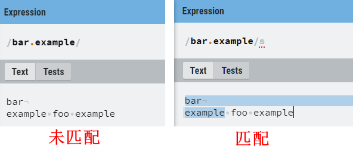
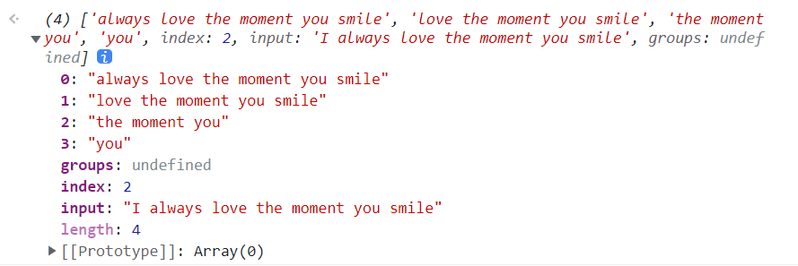
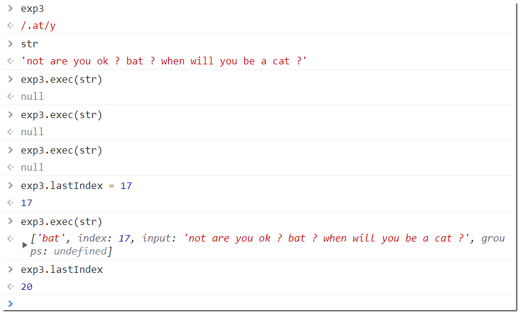
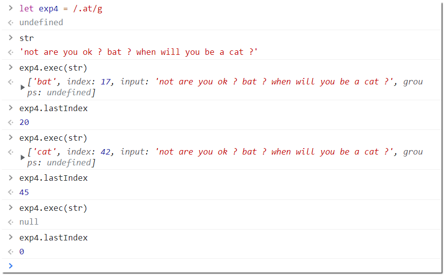

[TOC]

## 1. RegExp

ECMAScript 通过RegExp类型支持正则表达式。 

### 1.1 表示格式：

```javascript
let expression = /pattern/flags;
//or
let expression = new RegExp("pattern str","flags")// pattern str 不需要由"/.../"包裹，
```

- pattern : 正则表达式；
- flags : 匹配模式的标记；

> 示例：
>
> ```javascript
> let expression = /[bc]at/i;
> //or
> let expression = new RegExp("[bc]at","i"); // 注意构造函数的两个参数都是String, 且无需`/`包裹
> ```

> **注意：** 在通过构造函数来创建一个Pattern 的时候，第一个参数，除了可以传入String, 还能直接传入一个已有的Pattern ， 此时，构造函数的第二个参数，即Flags 将会覆盖第一个参数中携带的flags。 利用这个特点，可以实现Pattern 的复制 和 flags 的修改， 以下是一个示例：
>
> ```javascript
> const exp1 = /cat/g;
> const exp2 = new RegExp(exp1,'i') //  /cat/i
> ```

### 1.2 匹配模式：

> "Gimyus"

- g : global , 全局匹配
- i : ignore ,  大小写忽略
- m : multiline , 多行匹配
- y : sticky 粘附模式，表示从lastIndex开始查找
- u : Unicode 模式， 启用Unicode 匹配
- s : dotAll 模式，匹配任何字符（包括\n或\r）

> 全局匹配和多行匹配有什么区别？
>
> 可以理解为，`/m` 通常是和`/g` 一起使用以增强匹配模式。 以下是一个示例：
>
> ```
> hello my darling you
> are so sweat
> and hello my beauty
> hello my lady
> you are so kind
> hello my heartbeat
> you drum like a spring wind
> ```
>
> - 匹配模式 `/^hello/g` : 将会以整个字符串为匹配对象，仅仅匹配中字符串首部的单个“hello” 子字符串。 
> - 匹配模式 `/^hello/gm`：将会把每行自作单独的匹配对象，将会匹配选中 1,4,6 行首的“hello” 子字符串，共三个。

unicode 模式，将会启用Unicode 字符匹配的支持，以下是一个示例：

```javascript
const sentence = 'A ticket to 大阪 costs ¥2000 👌.';

const regexpEmojiPresentation = /\p{Emoji_Presentation}/gu;
console.log(sentence.match(regexpEmojiPresentation));
// expected output: Array ["👌"]
```


dotAll 模式， 默认情况下，dot `.` 能够匹配不包括 `\n`（换行）,`\r`（光标回到行首），之外的任意字符。 

当你所匹配的字符串中含有这两个元字符时， 如果不开启dotAll 模式，将不会被匹配到。 以下是一个示例：

[MDN](https://developer.mozilla.org/en-US/docs/Web/JavaScript/Reference/Global_Objects/RegExp/dotAll])上有这样一个demo:

```javascript
var str1 = 'bar\nexample foo example';

var regex1 = new RegExp('bar.example','s');

console.log(regex1.dotAll); // Output: true

console.log(str1.replace(regex1,'')); // Output: foo example

var str2 = 'bar\nexample foo example';

var regex2 = new RegExp('bar.example');

console.log(regex2.dotAll); // Output: false

console.log(str2.replace(regex2,'')); // Output: bar
                                      //         example foo example
```




### 1.3 RegExp 实例属性

gimyus 匹配模式是否开启，除了在创建实例对象时去指定，还可以通过RegExp 实例的属性访问，并且可以设定值，但是注意，dotAll 匹配模式除外， 它是一个只读属性。 你只能在创建一个RegExp 实例的时候去设定好它。 

如：

```javascript
let exp0 = /[bc]at/s
//or
let exp1 = new RegExp("[bc]at","s")
//or 如果有需要，你也可以直接复制拓展一个已有的实例
let exp2 = /[bc]at/
let exp22 = new RegExp(exp2,"s")
```

除了这些boolean 类型的属性，还有三个属性，分别是：

1. `source` : 正则表达式的字面量字符串；
2. `flags` : 正则表达式的模式标记字符串；
3. `lastIndex` : 整数类型，记录了在源字符串中下一次搜索的起始位置(后面会讲到)

```javascript
let exp0 = /[bc]at/sgm;
console.log(exp0.source);//"[bc]at"
console.log(exp0.flags);//"gms"
```


### 1.4 RegExp 实例方法

#### 1.4.1 `exec()` 

##### 1.4.1.1 基本用法

`exec()` 主要用于配合捕获组使用， 只接收一个参数，即要匹配的目标字符串。如果没有匹配则返回`null` ， 匹配则返回包含<span style="color:red">第一个</span>匹配信息的数组。

```javascript
RegExpPattern.exec("target string...")
```

>  :warning: 注意: 该方法返回的数据类型虽然是一个数组， 但是它比较特殊， 它包含了两个额外的属性：
>
> 1. `index` : 字符串中匹配模式的起始外置；
> 2. `input` ：要查找的字符串；

数组的第一个元素是匹配整个模式的字符串， 其他的元素是与表达式中的捕获组匹配的子字符串。 如果模式中并没有捕获组的花，那么数组值包含一个元素。 以下是一些示例：

**不包含捕获组的情况**

```javascript
let str = "I always love the moment you smile";
let exp = /love the moment/;
let result = exp.exec(str);
// result
["love the moment"]
```

实际上，还有刚才说的几个特殊属性,如果你在console 台查看  result :


**包含捕获组的情况**

```javascript
let str = "I always love the moment you smile";
let exp = /always (love (the moment (you)) smile)/;
let result = exp.exec(str);
// result
[
    "always love the moment you smile",
    "love the moment you smile",
    "the moment you",
    "you"
]
```



##### 1.4.1.2 `exec()` 和 `\g` 匹配模式

且看这样一个示例：


当一个字符串中有多处被Pattern 所匹配时， 设定了`/g` 的匹配模式和 不设定时的结果存在差异。 

即， 如果不设定`\g` ，那么不论`exec()` 执行了多少次， 返回结果始终只会返回第一个匹配到的结果。 看起来，就像是，每次都是重新匹配， 且匹配到了一个结果之后就退出了 ，不做记录。 

而如果设定了`/g` , 那么就会每次执行将会返回一个新的匹配到的 子串结果， 直到没有匹配项，返回`null` 为止， 看起来，就像是每次执行都记录了下一次预将执行的索引值位置， 这个值实际上就是 RegExp的实例属性`lastIndex`


注意，直接结果为null 之后，lastIndex 值被重新置0， 这意味着如果继续执行`exec()` 方法，那么会重新开始。

##### 1.4.1.3 `exec()` 和 `\y` 黏着匹配模式

如果你仔细观察`\g`匹配模式，不难发现，该模式每次返回的`lastindex` 值 +1 后，就正好是下一个匹配字符的起始位置。  相当的“智能”。 

`\y` 模式，则不同，它使得你在每次`exec()` 方法执行之前，都需要先明确下一个子串匹配的起始索引。并不会自动为你更新 lastIndex值为下一个匹配字符的正确位。



> 首次匹配，将从index = 0 的位置匹配，但是匹配不到所以返回null, 且永远不会将lastIndex 设定为下一次正确匹配所在的位置， 但是可以手动指定正确的lastIndex 值，不过，这次匹配成功了，返回了正常的结果，而lastIndex 被刷新为了下一个非空字符所在的索引值， 依旧不会是下一次正确匹配的索引，如果想要能匹配到，还是要手动指定其索引值 - - 
>
> > 是不是很无语 - - ， 我都知道了匹配项所在位置，我还tm需要用你来干啥？ 
> > 这个模式很少会用，可能某些特殊情况下才有用吧，例如遍历字符串，其不断刷新lastIndex值 ？或者知道了索引位去取对应的匹配项？



> 而 `\g ` 匹配模式则完全不同， 每次匹配后都会刷新lastIndex 的值。


#### 1.4.2 `test()`

```javascript
Pattern.test("target string...")
```

`test()` 方法用于判断某匹配Pattern 是否能够匹配到目标内容。 返回一个布尔值。

示例 ：

```javascript
let str = "I always love the moment you smile";
let exp = /love the moment/;
exp.test(str); // true

let exp2 = /love the bala moment/;
exp2.test(str); // false
```

