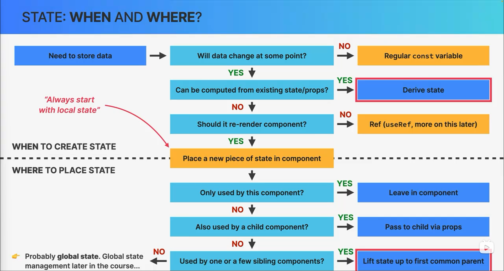
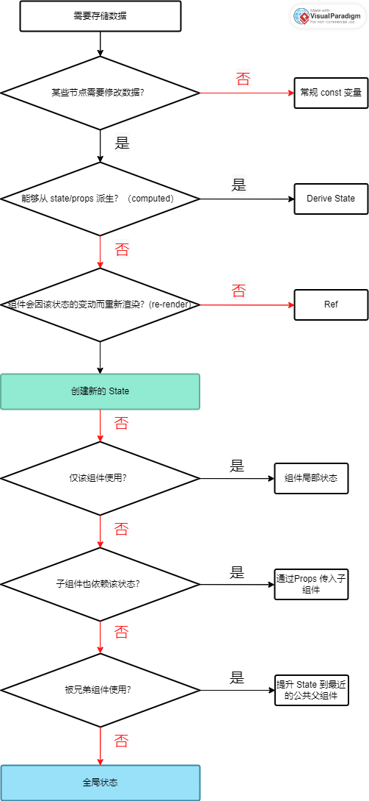

## `<React.StrictMode>`

React 中，使用脚手架工具创建项目以后，入口文件 main.jsx 中的严格模式是什么？

-   在开发过程中，让一个组件渲染两次（re-render）， 以便发现某些特定 bug
-   检查我们是否使用了 过时的 React API


## 关于 Props 和 State

Props 来自于父组件，且 **只能** 被父组件更新。

State 是组件内部的状态，它可以被组件内部的逻辑更新。

### 特别注意点

-   Props 是只读的， 它们是不可变更的，这是 React 的限定规则之一。
-   如果你确实需要修改 Props， 那么实际上， 你需要的是 State
-   正是因为 不可直接修改 Props 值， 所以 React 的数据流向为 单向数据流， 仅从父组件流向子组件

关于这两点为什么呢？

-   直接在组件内部修改 Props 将会影响到父组件，从而导致一些不可预期的副作用。
-   就 Props 和 State 而言，组件必须是纯函数（pure functions）
-   这些规则使得 React 可以按照内部规则去优化应用，避免 bug, 让应用的行为可被预测

p69

## 关于受控/非受控 (controlled/uncontrolled) 组件

### （非）受控组件 的概念是什么？

通常受控/非受控组件是针对表单组件的。 例如某个 input 元素， dom 中 target.value 是自己维护了一份数据值的。 我们不需要去手动绑定值，它的值更新由 dom 元素自身完成。 这种情况下叫做非受控组件。简单的说：

非受控组件（uncontrolled components） 值的是组件的状态不由 React 的状态管理，而是直接由 DOM 管理。与之相对的是 受控组件(controlled component) ，它们的状态完全由 React 的状态(state) 和 来自父级的传递值(props)来控制。

受控组件和非受控组件的示例：

```js
// 受控组件
import React, { useState } from "react";

function ControlledComponent() {
    const [inputValue, setInputValue] = useState("");

    const handleChange = (event) => {
        setInputValue(event.target.value);
    };

    return (
        <div>
            <input type="text" value={inputValue} onChange={handleChange} />
            <p>Input value: {inputValue}</p>
        </div>
    );
}

// 非受控组件
import React from "react";

function UncontrolledComponent() {
    return (
        <div>
            <input type="text" defaultValue="Hello World" />
            <p>Input value: (Managed by DOM)</p>
        </div>
    );
}
```

### 非受控组件存在哪些缺陷？

-   数据流不清晰： 非受控组件违背了 React 的单向数据流的概念，状态的更新和读取分散在不同地方，需要频繁使用 ref 获取 dom 元素的值。 容易引起数据不同步和逻辑混乱的问题
-   受控组件的数据同步问题
    假设场景： 你有 A/B 两个 input 元素，现在你希望这两个元素的数据时刻保持同步。 在受控组件中，只需要两个元素引用同一个 state 即可。 但是非受控组件两个元素内部自身维护了自己的 数据状态， 就无法做到实时同步。

### 非受控组件的使用场景？

在文件上传的时候， `file`类型的`input`元素， 它始终是一个不受控制的组件，
因为它的值只能由用户设置，而不是以编程方式设置。

我们只需要通过 ref 获取到用户选中的文件即可： `fileRef.current.files`

## 怎么判断是否需要 State，以及怎么应用 State?




